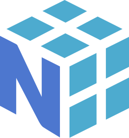

### Hi there, I'm Rizal

## I am an Independent Researcher, A Data Science Enthusiast, A Civil Engineer and a A Self-Taught Mathematician

- I am currenty working as a civil engineer in PT. PP (Persero) Tbk., a state-owned company of Indonesa
- I am still working on self-conducted researches in the field of mathematics and engineering
- I am currently-and-keep learning mathematics subjects by myself, which are mostly pure mathematics (measure theory, topology, functional analysis, algebra, etc)
- Occasionally, I love creating graphic designs
- My short term goal: publishing papers containing my current researches
- My not-too-long term goal: attending a post graduate programme in mathematics
- My long term goal: becoming a researhcer on mathematics-related fields and producing a lots of research papers
- Academic-related hobbies: reading math subjects, producing codes in Python, working on [Kaggle.com](https://www.kaggle.com/rizalpurnawan/code)
- Non-academic hobbies: playing futsal, playing FIFA, watching movies or TV series

 

### Get in touch with me:

 

### Languages, Tools and Packages:

<!---
rizalpurnawan23/rizalpurnawan23 is a ✨ special ✨ repository because its `README.md` (this file) appears on your GitHub profile.
You can click the Preview link to take a look at your changes.
--->
